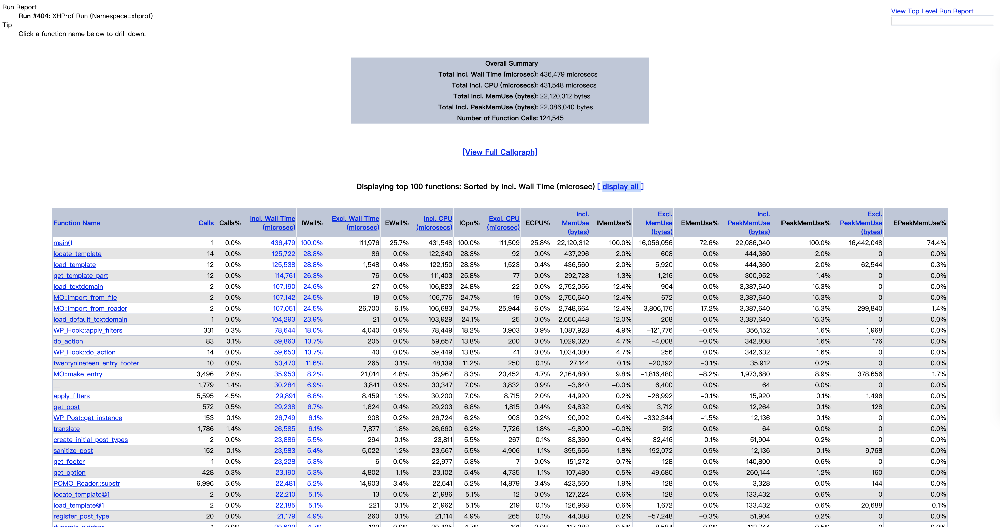
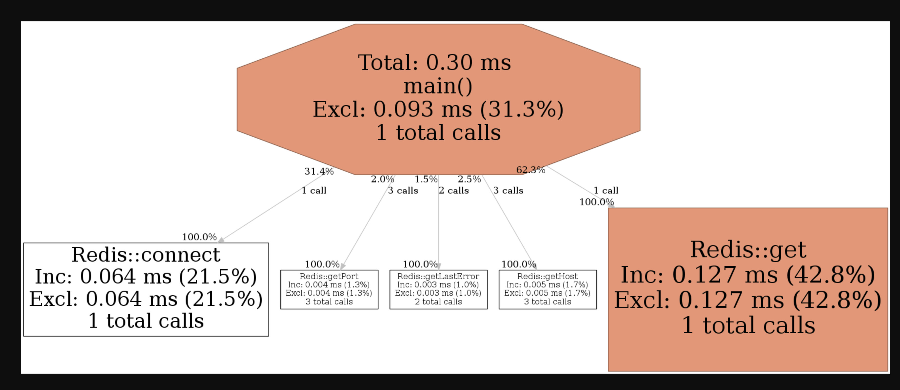
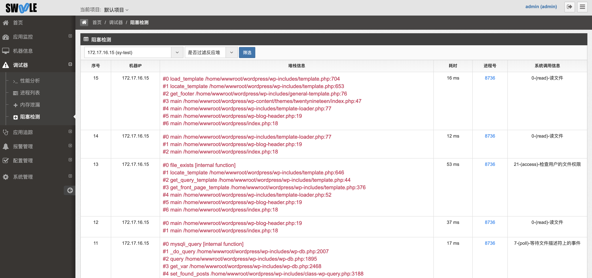

# 调试器

## 进程列表

统计客户端机器`fpm`和`cli`进程内存占用和CPU占用


## 远程调试

对于以下三种工具，v2.4.3版本以后可以直接在服务端点击按钮远程开启后进行调试，无需修改代码，重启服务。开启后发生请求，日志自动上传服务端后台进行分析展示


> **对性能有所影响，开启调试完毕后请及时关闭。**


## 手动埋点调试

> v2.3.3版本以后默认关闭调试功能，手动埋点时需要在php.ini中添加配置：[点击查看](https://www.yuque.com/swoole-wiki/dam5n7/rbth3m#bMVdt) 
>
> v2.4.3版本支持远程调试。**远程调试和手动埋点二选一即可，不可重复开启。**
>
> **性能分析、内存泄漏、阻塞检测都比较影响性能，建议在开发/测试环境中使用。**
>
> **如需在生产环境中使用，在使用后请尽快移除。**
>
> **注意不要同时开启多个工具,例如代码中同时startXhprof() 和 startBlockCheck() 这样会相互影响导致结果都不准确。**

### 性能分析


在客户端需要进行性能分析的代码中进行手动埋点

- 在代码开头添加

```
startXhprof();
```

- 在代码结束添加

```
endXhprof();
```

实例：

```
<?php
// 开始
startXhprof();

function a($arg){
  echo $arg;
}
a(123);

// 结束
endXhprof();
```

#### 分层分析表



#### 调用图

客户端会自动上报生成的日志信息，在后台就可以看到所生成的性能瓶颈图




图中会指出：函数；`Inc`函数运行时间，包括子函数；`Excl`函数运行时间，不包括子函数；`total calls`总调用次数；

#### 火焰图


增加了查看火焰图的功能，火焰图是性能分析的利器，并可以与用户互动。


- 鼠标悬浮

火焰的每一层都会标注函数名，鼠标悬浮时会显示完整的函数名、抽样抽中的次数、占据总抽样次数的百分比。


下面是一个例子：


- 点击放大

在某一层点击，火焰图会水平放大，该层会占据所有宽度，显示详细信息。


左上角会同时显示"Reset Zoom"，点击该链接，图片就会恢复原样。


- 搜索

按下 `Ctrl + F`  或者点击图中右上角的 `Search` 会显示一个搜索框，用户可以输入关键词或正则表达式，所有符合条件的函数名会高亮显示。


### 内存泄漏


> ⚠️⚠️⚠️此功能目前仅支持PHP70以上版本，不包括PHP70 


在客户端需要进行内存泄漏检测的代码中进行手动埋点


- 在代码开头添加


```
startMemleakCheck();
```


- 在代码结束添加


```
endMemleakCheck();
```


实例：


```
<?php
// 开始
startMemleakCheck();

$redis;
function a(){
    global $redis;
    $redis  = new \redis();
    $result = $redis->connect('127.0.0.1', 6379);
    $redis->set("dasda",123123);
    var_dump($redis->get("dasda"));
}
a();

// 结束
endMemleakCheck();
```


会说明存在内存泄漏到文件行数，对应到键名，此处可能需要进行修改或者进行 `unset` 


### 阻塞检测


>  ⚠️该检测不追踪fork的子进程。


在客户端需要进行阻塞检测的代码中进行手动埋点





> **反应堆**解释：
>
> 如果使用swoole会产生较多的的epoll_wait、epoll_wait_old、epoll_pwait，等待事件发生。可选择检测时列表是否将此类信息过滤不进行展示。

- 在代码开头添加

```
startBlockCheck();
```

- 在代码结束添加

```
endBlockCheck();
```

默认检测阻塞10ms的数据，大于这个值的系统调用就认为是阻塞的，如果要修改请编辑文件 `/opt/swoole/public/sdk/config_common.conf` 

```
{"protocol":"TCP","block_time_out":"10"}
```

修改 `block_time_out` 的值